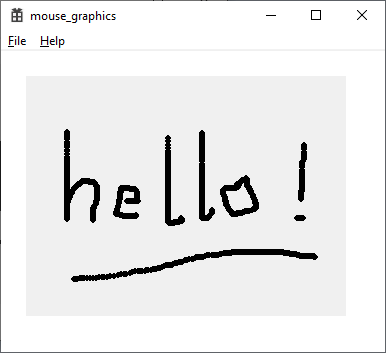

# mouse_graphics

  

Experiment to record mouse moves and later replay

There are two programs here. One is a Windows C++
project to capture then replay mouse activity. 

Then the teensy_touch subdir has something similar
for the touch interface on an ILI9341 attached to
a Teensy 4.
